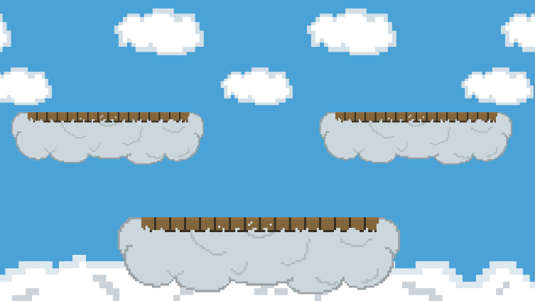
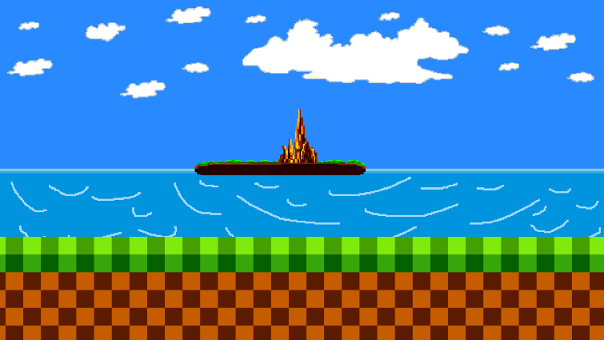

<div align="center">


# Road Battlers

**A couch-co-op 2D pixel-art brawler for two players with gamepads.**

Pick a fighter, pick a stage, and knock your friend out of all three lives.


*Built by Nine Lives Interactive as a STEM POE project and shown at the STEM Showcase.*

</div>

---

## The Game

Road Battlers is a local 1v1 fighting game. Each player joins with a controller, picks one of three fighters, and drops into an arena. Punch up close, throw projectiles from range, and hold out for your special bomb. The last player with lives left wins.

### Stages

| Sky City | Blu Island |
| :---: | :---: |
|  |  |
| Wooden platforms floating above the clouds, with clouds drifting past. | A seaside arena on checkered green hills. |

### Fighters

| Player 1 | Player 2 |
| --- | --- |
| Avocado | Baseball |
| DaQuan | Munch |
| Unit B (Robot) | Terrance |

## How to Play

1. Plug in **two gamepads**. The game has no keyboard controls.
2. Press **Start** on the main menu.
3. Player 1 picks a fighter from their column, then Player 2 picks from theirs.
4. Choose a stage.
5. In the arena, each player **presses a button on their controller to join**. The first controller to join is Player 1.

### Controls

Button names follow the Xbox layout. PlayStation equivalents are in brackets.

| Action | Button |
| --- | --- |
| Move | Left stick |
| Jump | A &nbsp;[✕] |
| Punch | X &nbsp;[□] |
| Throw | B &nbsp;[○] |
| Special bomb | Y &nbsp;[△] |
| Pause | Start / Options |

### Rules

- Each fighter has **100 health** and **3 lives**.
- Hits deal damage based on the attack:

  | Attack | Damage |
  | --- | --- |
  | Throw | 5 |
  | Punch | 10 |
  | Special bomb | 40 |

- After any attack you have to wait **2.5 seconds** before attacking again.
- The **special bomb** unlocks **200 seconds** into the match.
- Falling off the stage costs a whole life. When your health hits 0 you lose a life and respawn.
- Lose all three lives and your opponent wins. From the winner screen you can play again or go back to the menu.

## Project Layout

```
RoadBattlers/                  Unity project root
├── Assets/
│   ├── Scenes/                Main Menu → Select Screens → Sky City / Blu Island
│   ├── Scripts/               Gameplay C# (movement, combat, menus, spawners)
│   ├── Input Actions/         Gamepad input map (Unity Input System)
│   ├── Animation Files/       Per-character sprite sheets and animators
│   ├── Prefabs/               Players, weapons, cars, UI
│   ├── Art/                   Backgrounds, platforms, logo
│   └── Sounds/                Sound effects and themes
GarageBand Files/              Source projects for the original music and SFX
```

Key scripts:

| Script | What it does |
| --- | --- |
| [`GameManager.cs`](RoadBattlers/Assets/Scripts/GameManager.cs) | Handles player joining and spawn points |
| [`PlayerInputHandler.cs`](RoadBattlers/Assets/Scripts/PlayerInputHandler.cs) | Spawns the selected fighter and forwards gamepad input, plus pause |
| [`PlayerMovement.cs`](RoadBattlers/Assets/Scripts/PlayerMovement.cs) | Movement, jumping, attacks, health, lives, and the win condition |
| [`SelectScreenManager.cs`](RoadBattlers/Assets/Scripts/SelectScreenManager.cs) | Character and stage selection |

## Credits

**Nine Lives Interactive**: Montgomery Brown ([@MintyTheCoder](https://github.com/MintyTheCoder)), Brodie Liverman, Mekhi Boyd

Original sound effects and themes were made in GarageBand (see `GarageBand Files/`).

Third-party assets:
- *Battle Music Pack (Demo)*: battle music
- *Free Casual Pack SFX*: power-up and pop sounds
- *Thaleah Pixel Font*: UI font
